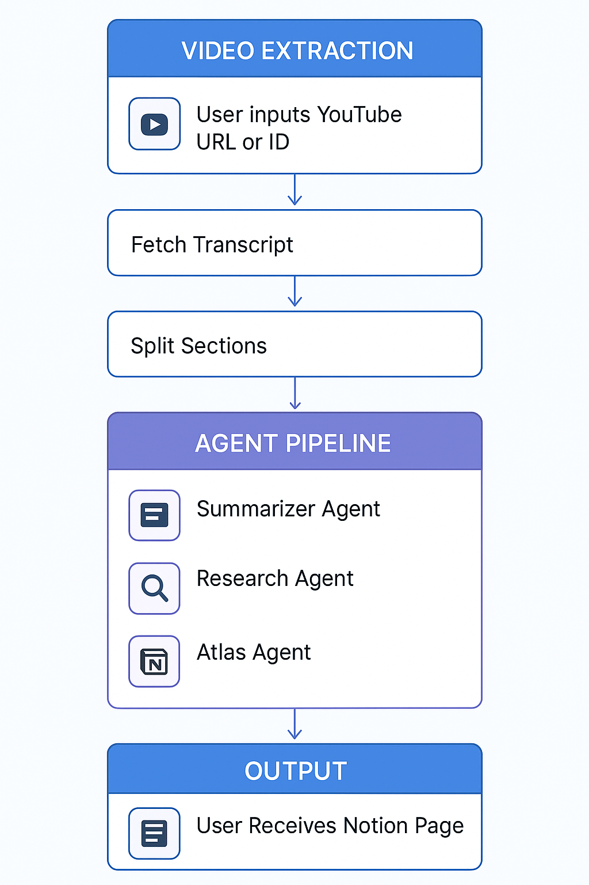
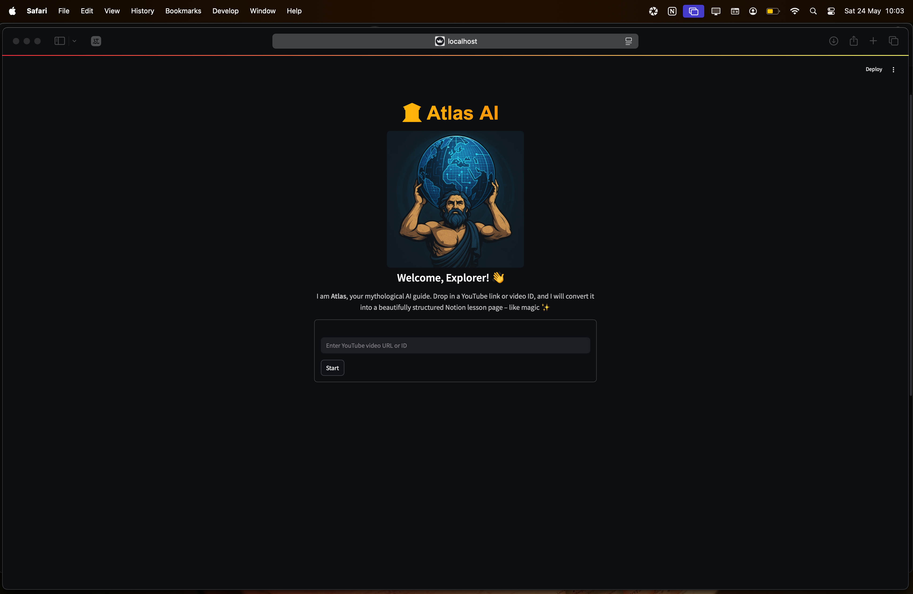
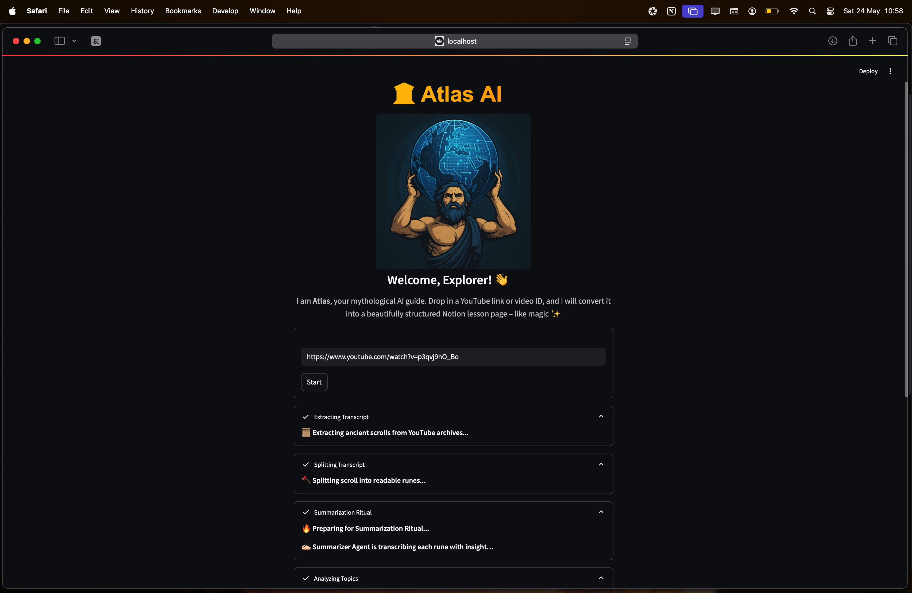
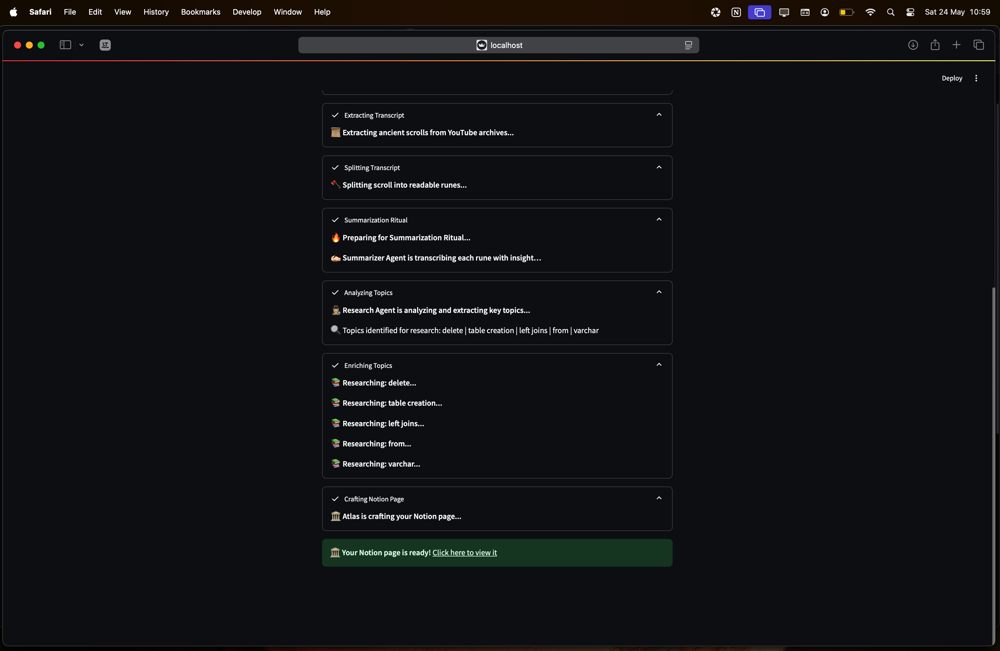
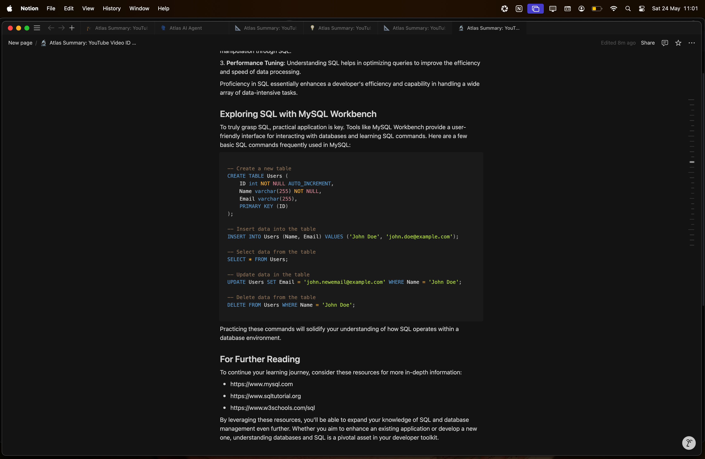

# 🏛️ Atlas AI Agent

<p align="left">
  
  
  
  
</p>

<p align='center'>
    
</p>

**Atlas** is a mythologically-inspired AI agent that transforms YouTube videos into **beautifully structured Notion pages**.  
It extracts transcripts, summarizes content, enriches it with research, and outputs a Notion page.

---

## Table of Contents

- [Features](#features)
- [Quickstart](#quickstart)
- [Architecture Flowchart](#architecture-flowchart)
- [How It Works](#how-it-works)
- [Project Structure](#project-structure)
- [Setup & Usage](#setup--usage)
- [App Demonstration](#app-demonstration)
- [Why Atlas?](#why-atlas)
- [Possible Improvements & Known Issues](#possible-improvements--known-issues)
- [Use Cases](#use-cases)
- [Examples](#examples)
- [Author](#author)
- [License](#license)

---

## Features

- Input a YouTube URL or Video ID
- Auto-transcription & summarization of video content
- Topic enrichment through external research
- Automatic Notion page generation
- Fun, interactive Streamlit interface with visual feedback

---

## Quickstart

```bash
git clone https://github.com/luuisotorres/atlas-ai-agent.git
cd atlas-ai-agent
uv pip install -r pyproject.toml
cp .env.example .env  # Add your API keys and Notion page ID
streamlit run main.py
```

---

## Architecture Flowchart

<p align="center">
  
</p>

## How It Works

Here's a step-by-step breakdown of how **Atlas** transforms a YouTube video into a polished Notion page:

### 1. Input

The user provides a YouTube URL or Video ID using the Streamlit interface. The input is processed by the `utils.py` module inside the `core/` directory to extract a valid video ID.

### 2. Transcript Extraction

Inside the `processors/` directory:
- `transcript_fetcher.py` uses the YouTube Transcript API to fetch the transcript for the video.
- `section_splitter.py` organizes the transcript into logical sections of approximately 5 minutes each.

Intermediate data is stored in the `transcript_files/` folder as `sections_<video_id>.json`.

### 3. Summarization

Inside the `agents/` directory:
- `summarizer_agent.py` reads the transcript sections and generates clean, educational markdown summaries for each using OpenAI's **GPT-4o model**.
  
These summaries are saved as `summarized_sections_<video_id>.json`.

### 4. Topic Enrichment

- `research_agent.py` extracts key bolded terms from the summaries and enriches them using DuckDuckGo search.
- It formats the output in markdown, including definitions, examples, and further reading links.

The enrichment is saved as `enrichment_data_<video_id>.json`.

### 5. Lesson Generation

- `atlas_agent.py` merges the summaries and enrichment data into a single structured Notion-compatible lesson.
- It formats the lesson using headings, bullets, quotes, and code blocks in markdown.
- It then creates a Notion page under the parent page ID defined in the `.env` file (`NOTION_PARENT_PAGE_ID`)and uploads all the content.

### 6. Output

The user receives a polished, structured Notion page automatically generated based on the YouTube video.

## Project Structure

```
.
├── agents/               # Core AI agents: summarizer, researcher, Atlas
├── assets/               # Images for illustration
├── core/                 # Utilities
├── notion_pages_pdf/     # Exported PDFs of Notion pages
├── processors/           # Transcript fetcher & section splitter
├── transcript_files/     # Intermediate transcript and enrichment data
├── ui/                   # Streamlit interface
├── main.py               # Entrypoint for running the app
└── pyproject.toml        # Uv project configuration
```

---

## Setup & Usage

This project uses **[uv](https://github.com/astral-sh/uv)** for dependency management.
It also uses **[Agno](https://github.com/agno-agi/agno)** to simplify the design and orchestration of **AI Agents**.

### 1. Clone the repo
```bash
git clone https://github.com/luuisotorres/atlas-ai-agent.git
cd atlas-ai-agent
```

### 2. Install dependencies
```bash
uv pip install -r pyproject.toml
```

### 3. Python version
Make sure your Python version matches the one specified in the `.python-version` file.

### 4. Configure your `.env` file
Copy the `.env.example` file:

```bash
cp .env.example .env
```

Enter your OpenAI API key, notion token, and Notion parent page ID.
```
OPENAI_API_KEY=your_openai_key
NOTION_TOKEN=your_integration_token
NOTION_PARENT_PAGE_ID=your_notion_page_id
```

#### What is `NOTION_TOKEN`?
This is the internal integration token from Notion that allows **Atlas** to create and edit pages on your behalf.

To get it:
1. Go to [https://www.notion.so/my-integrations](https://www.notion.so/my-integrations)
2. Click `New Integration` and give it a name.
3. Copy the internal integration token and paste it into your `.env`.

#### What is `NOTION_PARENT_PAGE_ID`?
This is the ID of the Notion page where new pages will be created under.

To get it:
1. Open the Notion page you want to use as the parent.
2. Click the three dots on the top of the page `...` → `Connections` → Add your integration.
3. Click on `Share` → `General access` → `Anyone on the web with link`.
3. Copy the URL of the page — the part after `notion.so/` and before `?` is your Page ID (`NOTION_PARENT_PAGE_ID`).

### 5. Run the app
```bash
streamlit run main.py
```

---

## App Demonstration

<p align="center">
  <br>
  <em>Interface: Enter YouTube URL or ID and let **Atlas** do the job</em>
</p>

<p align="center">
  <br>
  <em>Watch the agents work step-by-step: transcription, summarization, and research</em>
</p>

<p align="center">
  <br>
  <em>Topic enrichment in action, adding depth and context to the summary</em>
</p>

<p align="center">
  <br>
  <em>Automatically generated Notion page: clean, structured, and enriched</em>
</p>

<p align="center">
  <br>
  <em>Each section is clear, well-formatted, and easy to navigate in Notion</em>
</p>

---

## Why Atlas?

- Unlike simple ChatGPT chats, Atlas creates **long-form structured content automatically**.
- Outputs beautiful, Notion-ready markdown pages in minutes.
- Adds **real research context** to your summaries.
- Designed for **learners, content creators, and educators**.

---

## Possible Improvements & Known Issues

### Improvements on the Roadmap:
- [ ] Support for multi-language transcripts
- [ ] Option to choose between different summarization styles
- [ ] Add more emojis to Notion pages
- [ ] Add images to Notion pages for illustration purposes
- [ ] Add support for Notion Databases
- [ ] Export to PDF locally

### Known Issues:
- Some YouTube videos don't have transcripts (e.g., music or live streams).
- Notion rate limits may cause errors if used heavily within a short timeframe.
- DuckDuckGo enrichment is not always perfectly aligned with the context.

---

## Use Cases

- **Students** generating notes from lecture videos
- **Teachers** turning lessons into educational Notion pages
- **Professionals** documenting webinars and talks
- **YouTubers** creating course material from their own videos
- **Writers** building structured knowledge bases from content

---

## Examples

Want to see what Atlas generates?

👉 [Sample Notion Pages (PDFs)](notion_pages_pdf/)

This folder contains exported PDFs of the final Notion pages generated by **Atlas** from different YouTube videos.

---

## Author

[Luis Fernando Torres](https://github.com/luuisotorres)

[](https://www.linkedin.com/in/luuisotorres/)
[](https://medium.com/@luuisotorres)
[](https://www.kaggle.com/lusfernandotorres)
[](https://huggingface.co/luisotorres)

---

## License

MIT License